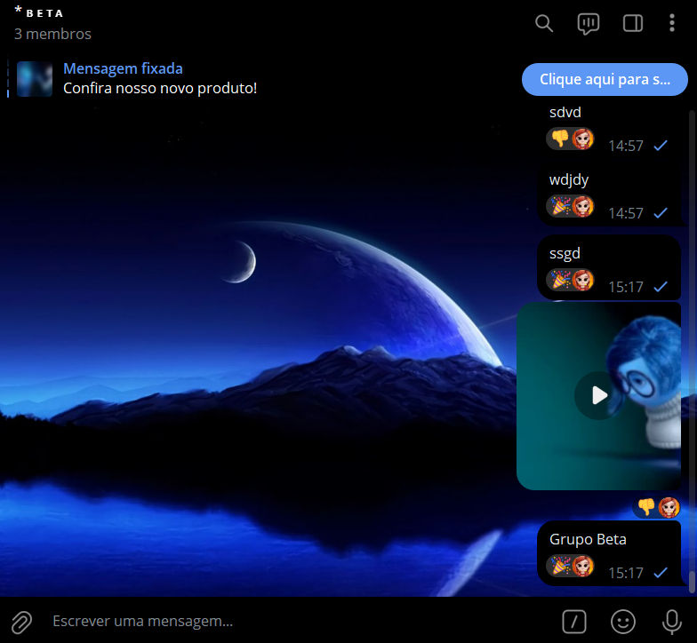
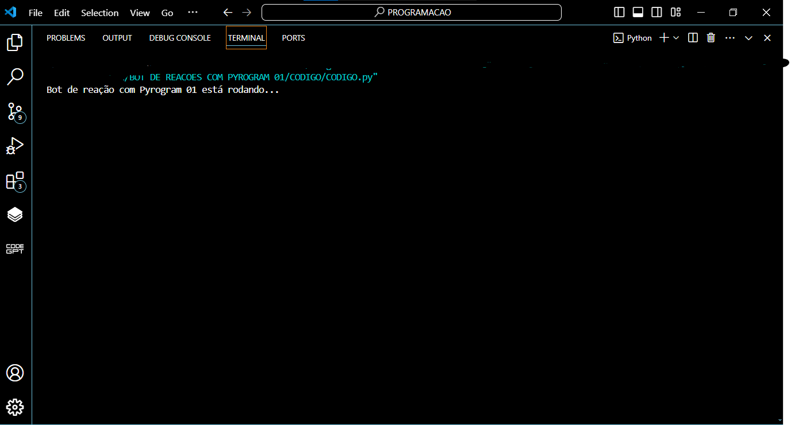

# BOT DE REACOES COM PYROGRAM 01
🛑USE SEU PERFIL PESSOAL DO TELEGRAM PARA REAGIR A UMA NOVA MENSAGEM POSTADA NOS GRUPOS AUTOMATIMANTE!

 <br>
 <br>

## DESCRIÇÃO:
Este bot, desenvolvido utilizando o Pyrogram, reage automaticamente a todas as mensagens postadas em um grupo do Telegram com uma reação aleatória. Ele utiliza uma lista de emojis pré-definidos para selecionar uma reação de forma aleatória e a envia como resposta a cada nova mensagem nos grupos que estiver presente.

## FUNCIONALIDADES:
- **Reações Aleatórias:** O bot escolhe aleatoriamente entre uma lista de emojis, incluindo '👍', '👎', '❤', '😄', '😊' e '🎉' (Você pode colacar mais emojis se quiser), para reagir a cada nova mensagem nos grupos.
- **Perfil Personalizado:** O bot pode ser personalizado com o avatar do seu perfil pessoal, ao invéz de usar o avatar criado no @botfather.

## PROCEDIMENTO DE COMPRA:
- Para efetuar a compra, por favor, entre em contato comigo por mensagem privada, informando:
    ```bash
    Gostaria de adquirir o bot: https://github.com/VILHALVA/BOT-DE-REACOES-COM-PYROGRAM-01
    ```
- Após a confirmação do pagamento e o envio do comprovante, você receberá um arquivo zip contendo o código-fonte do bot, acompanhado de um manual detalhado (`MANUAL.md`), que oferece instruções abrangentes sobre a configuração do ambiente, sugestões de cursos e documentação recomendada, bem como o arquivo `HOSPEDAGEM.md`, contendo orientações para hospedar o seu bot.
- [🤑CLIQUE AQUI PARA ENTRAR EM CONTATO](https://t.me/VILHALVA100)
- [🧑‍💻PRECISA DE UM FREELANCER? CLIQUE AQUI PARA VER EM TELEGRAPH](https://telegra.ph/FREELANCER-10-19-9)
- [🧑‍💻PRECISA DE UM FREELANCER? CLIQUE AQUI PARA VER EM README](https://github.com/VILHALVA/VILHALVA/blob/main/FREELANCER/README.md)
